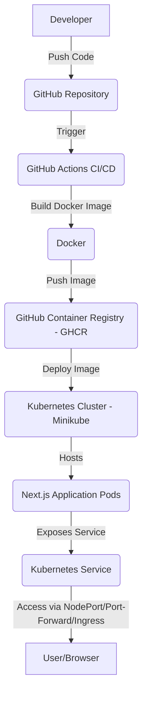

# Next.js DevOps Deployment

## Project Overview

This project demonstrates a comprehensive DevOps workflow for a Next.js application, encompassing containerization, automated Continuous Integration/Continuous Deployment (CI/CD), and deployment to a local Kubernetes cluster (Minikube). It showcases best practices for building, testing, and deploying modern web applications in a consistent and repeatable manner.

## Purpose

The primary purpose of this project is to illustrate a full-stack DevOps pipeline for a Next.js application, covering:

*   **Containerization** using Docker for consistent environments.
*   **Automated CI/CD** with GitHub Actions to streamline build and deployment processes.
*   **Deployment** to a local Kubernetes cluster (Minikube) for scalable and resilient application hosting.
*   **Multiple access methods** to test and interact with the deployed application.

## Technology Stack

| Category         | Technology                                   |
| :--------------- | :------------------------------------------- |
| **Frontend**     | Next.js (React-based, Server-Side Rendered)  |
| **Runtime**      | Node.js & npm                                |
| **Containerization** | Docker (Multi-stage builds)                  |
| **Version Control** | Git & GitHub                                 |
| **CI/CD**        | GitHub Actions                               |
| **Orchestration** | Kubernetes (Minikube, Deployment, Service)   |
| **Operating System** | Ubuntu 22.04 LTS (or similar Linux VM)       |

## Architecture Overview

The project's architecture follows a standard cloud-native approach, leveraging containerization and orchestration for robust deployment. The Next.js application is containerized using Docker, ensuring environmental consistency from development to production. GitHub Actions serve as the CI/CD pipeline, automatically building and pushing Docker images to GitHub Container Registry (GHCR) upon code changes. These images are then deployed to a Kubernetes cluster (Minikube for local development), managed by Kubernetes Deployment and Service resources. The application can be accessed via various methods, including NodePort, Port-Forwarding, or an optional Ingress controller.

## Detailed Documentation

For an in-depth understanding of each component and step, please refer to the following detailed documentation files:

*   [Prerequisites & Environment Setup](docs/prerequisites.md)
*   [Project Setup & Local Run](docs/local-setup.md)
*   [Dockerization](docs/dockerization.md)
*   [CI/CD Setup Using GitHub Actions](docs/ci-cd.md)
*   [Kubernetes Deployment & Application Access](docs/kubernetes-deployment.md)
*   [Project Directory Walkthrough](docs/directory-walkthrough.md)
*   [Key Features Implemented](docs/features.md)

